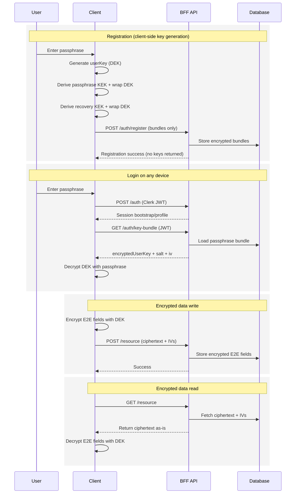
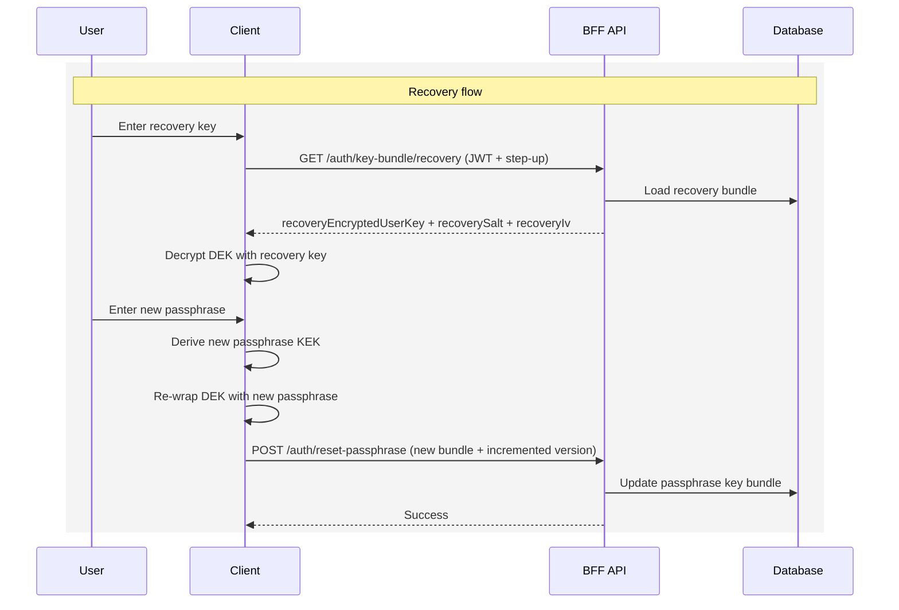
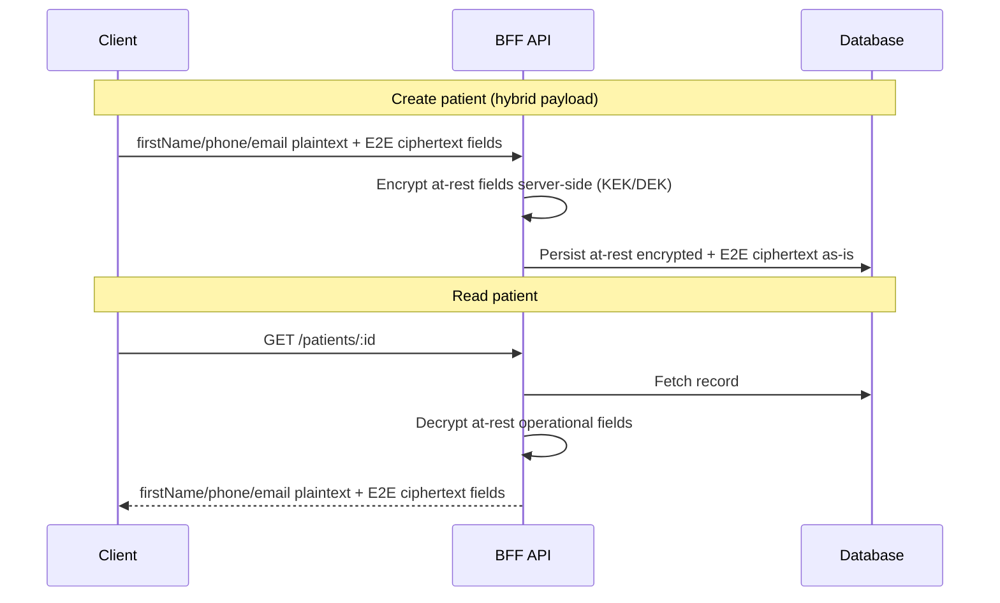

# Hybrid E2E Encryption + Recovery Plan (TerappIA Backend)

This document updates the original strict E2E proposal to match current TerappIA product requirements and runtime needs.

Frontend implementation companion:
- `docs/e2e-frontend-react-spec.md`

## Why Hybrid (not full strict for all fields)

TerappIA currently needs backend runtime access to a subset of patient fields for operational workflows (reminders/WhatsApp):

- `firstName`
- `phone`
- `email`

Because of that, the target is **hybrid encryption**:

- **At-rest server-readable encryption** for runtime-required fields.
- **Client-side E2E encryption** for sensitive fields that backend does not need in plaintext.
- **Plaintext/non-E2E** for non-sensitive domains such as `settings` and `payments`.

---

## Final Data Policy

### 1) At-rest server-readable (keep current server DEK model)

- `patient.firstName`
- `patient.phone`
- `patient.email`
- Therapist calendar token fields already using at-rest server encryption remain as-is.

### 2) E2E (client encrypts, backend stores/returns ciphertext)

- `patient.lastName` (explicitly decided)
- Notes (`note.encryptedText` / `textIv`)
- Any additional sensitive fields not required by backend runtime.

### 3) Non-E2E (by product decision)

- `settings`
- `payments`

---

## Naming Clarification (to avoid confusion)

Use distinct terms for at-rest vs E2E key lifecycle:

- **`atRestKekVersion`**: version used for server-managed at-rest DEK wrapping.
- **`userKeyBundleVersion`**: version for client E2E key bundle rotation/reset.

Do not use generic `keyVersion` without context.

---

## Current State (Relevant)

- Auth flow is Clerk-based (`POST /auth` for bootstrap) and does not return decrypted `userKey`.
- Key bundle APIs are implemented:
  - `GET /auth/key-bundle`
  - `GET /auth/key-bundle/recovery`
  - `POST /auth/reset-passphrase`
- Legacy server-side E2E interceptors and `UserKeyValidationGuard` are removed from BFF routes.
- Legacy local refresh-token auth flow is removed from runtime contracts.

Remaining major TODO in this plan: endpoint rate limiting and step-up auth for recovery bundle access.

---

## Target Auth + Key Management Contracts

## 1) Registration

**Endpoint:** `POST /auth/register`
`TODO(security)`: Add strict endpoint rate limiting (per IP + anti-abuse controls).

Server behavior in new flow:
- Create therapist account (Clerk-linked).
- Derive `externalId` from authenticated Clerk context (do not trust body identity fields).
- Persist E2E key bundles received from client.
- Do **not** set passphrase internally (remove current wrong behavior where therapistId is used).
- Do **not** return decrypted user key.

Client behavior:
- Generate `userKey` (DEK) with WebCrypto.
- Derive passphrase KEK and produce `encryptedUserKey` bundle.
- Derive recovery KEK and produce recovery bundle.
- Send bundles only.

## 2) Login/session establishment

**Endpoint used today:** `POST /auth` (Clerk-authenticated)
`TODO(security)`: Add endpoint-specific rate limiting (per IP + per externalId).

Target behavior:
- Return auth/session data only.
- Do **not** receive passphrase plaintext.
- Do **not** decrypt or return `userKey`.

## 3) Fetch key bundles

**Endpoint:** `GET /auth/key-bundle`
`TODO(security)`: Add rate limiting (per therapist + per IP) to reduce key-bundle scraping risk.

Response should include only stored bundles/metadata, for example:

```json
{
  "encryptedUserKey": "...",
  "salt": "...",
  "iv": "...",
  "userKeyBundleVersion": 1
}
```

## 4) Fetch recovery bundle (recovery flow only)

**Endpoint:** `GET /auth/key-bundle/recovery`
`TODO(security)`: Add strict rate limiting + step-up authentication for recovery bundle access.

Response should include only recovery bundle material:

```json
{
  "recoveryEncryptedUserKey": "...",
  "recoverySalt": "...",
  "recoveryIv": "...",
  "recoveryEnabled": true,
  "userKeyBundleVersion": 1
}
```

## 5) Reset passphrase via recovery

**Endpoint:** `POST /auth/reset-passphrase`
`TODO(security)`: Add strict sensitive-action rate limiting + lockout/backoff policy.

Payload (client-generated new passphrase bundle):

```json
{
  "encryptedUserKey": "...",
  "salt": "...",
  "iv": "...",
  "userKeyBundleVersion": 2
}
```

Server behavior:
- Replace passphrase bundle.
- Update `userKeyBundleVersion`.
- Reject non-incrementing bundle version updates (must be greater than current).
- Never verify recovery secret server-side (client-only operation).

---

## Sequence Diagrams

### 1) Overall E2E Flow



### 2) Recovery Flow (Forgot Passphrase)



### 3) Hybrid Runtime Fields vs E2E Fields



---

## Therapist Data Model (E2E Bundle Fields)

Keep existing and add/standardize:

- `encryptedUserKey`
- `salt`
- `iv`
- `recoveryEncryptedUserKey`
- `recoverySalt`
- `recoveryIv`
- `recoveryEnabled`
- `userKeyBundleVersion`

---

## Backend Encryption Flow Changes

## Interceptors and guard strategy

For E2E-managed routes:
- Remove `RequestEncryptionInterceptor`/`EncryptionInterceptor` usage.
- Remove `UserKeyValidationGuard` dependency for E2E payload flows.
- Replace with request format validation (ciphertext + IV shape checks), not decryption.

For at-rest runtime-required fields:
- Keep current server-side at-rest encryption/decryption paths in services.

---

## Route Scope Guidance

### Keep runtime decryption paths (for now)

- Patient contact extraction used by reminders/WhatsApp (`firstName/phone/email`).

### Move to strict E2E behavior

- Fields/routes where backend does not need plaintext at runtime.
- `patient.lastName` explicitly included in this group.

### Out of scope for this phase

- `export/excel` E2E migration (explicitly deferred).

---

## Migration Strategy (Testing phase with small user base)

Given current environment (small testing users), use **fresh-start migration**:

1. Implement new contracts and DB columns.
2. Disable legacy server passphrase/key-return behavior.
3. Reset existing test users and re-onboard with new client-generated bundles.
4. Verify E2E + at-rest hybrid flows.

This avoids complex backward-compatible migration logic for now.

---

## Security Requirements

### Critical Security Conditions (Must Hold)

- Never store or log passphrase plaintext, recovery secret plaintext, or decrypted `userKey`.
- Validate E2E payload shape on ingress (ciphertext + IV + required fields) before persistence.
- Use strong KDF parameters for passphrase/recovery derivation (Argon2id preferred; hardened fallback if not available).
- Enforce unique IV/nonces for AES-GCM operations (client and server side where applicable).
- Keep key material memory-only on client runtime; no localStorage/sessionStorage persistence for decrypted key bytes.
- Keep strict XSS protections in FE (`CSP`, dependency hygiene, output escaping) because client-held keys are the primary risk surface.
- Apply endpoint-level rate limiting on auth/key-management APIs (`/auth`, `/auth/register`, `/auth/key-bundle`, `/auth/key-bundle/recovery`, `/auth/reset-passphrase`, `/auth/change-passphrase`).
- Preserve backend fail-closed behavior for malformed crypto payloads; return explicit 4xx errors instead of partial processing.

- Never log passphrase, recovery key, decrypted user key, ciphertext payload values.
- Keep TLS mandatory.
- Recovery key is display-once client secret.
- If recovery key is lost, E2E data is unrecoverable.
- Preserve existing pino redaction rules for auth headers and `x-user-key`.

---

## Testing Scenarios

1. Registration stores bundles without server passphrase handling.
2. `POST /auth` no longer returns decrypted user key.
3. `GET /auth/key-bundle` returns only passphrase bundle material (no recovery fields).
4. `GET /auth/key-bundle/recovery` returns recovery bundle only in recovery flow.
5. `POST /auth/reset-passphrase` updates bundle and increments `userKeyBundleVersion`.
6. At-rest runtime fields (`firstName/phone/email`) continue working for reminders/WhatsApp.
7. E2E fields (`lastName`, notes) are stored/returned as ciphertext and decrypted only client-side.
8. `settings` and `payments` unchanged.

---

## Implementation Checklist

- [x] Remove server-side passphrase misuse in registration flow.
- [x] Add/standardize therapist recovery bundle columns + `userKeyBundleVersion`.
- [x] Add `GET /auth/key-bundle` endpoint.
- [x] Add `GET /auth/key-bundle/recovery` endpoint (separate recovery bundle access).
- [x] Add `POST /auth/reset-passphrase` endpoint.
- [x] Update `POST /auth` response contract to remove decrypted key output.
- [x] Introduce E2E ciphertext-shape validation for E2E routes.
- [x] Remove interceptor/`UserKeyValidationGuard` dependency from E2E routes.
- [x] Keep at-rest service encryption for runtime fields (`firstName/phone/email`).
- [x] Update docs and frontend integration notes.

---

## Rate Limiting TODOs (Definition of Done)

Detailed implementation plan is documented in `docs/auth-rate-limiting-plan.md`.

For each TODO endpoint, done means:
- A limiter is configured with clear key strategy (`ip`, `actor`, or both) and explicit window/threshold.
- Exceeded limit returns `429` consistently with retry semantics (`Retry-After`).
- Rejections are auditable via logs/audit trail without sensitive payloads.
- Automated tests cover allow-under-limit and block-over-limit scenarios.

Endpoint guidance:
- `POST /auth`: per IP + per externalId.
- `POST /auth/register`: strict per IP + abuse controls.
- `GET /auth/key-bundle`: per therapist + per IP.
- `GET /auth/key-bundle/recovery`: stricter than normal key-bundle + step-up auth gate.
- `POST /auth/reset-passphrase`: strict per therapist + per IP + backoff.
- `POST /auth/change-passphrase`: strict per therapist + per IP.

---

## Notes for Implementer

- Keep TypeScript strict.
- Do not re-introduce server plaintext key handling in E2E flow.
- Keep existing runtime-dependent workflows functional during transition.
- For this phase, prioritize correctness over backward compatibility (test-user reset is accepted).
